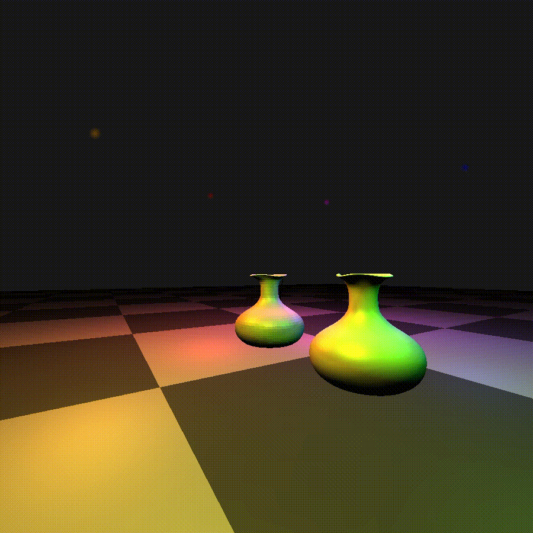

# Vulkan-Engine-cpp
This program uses Vulkan to render inside of a GLFW window and requires your computer to be compatible with Vulkan. \
This is a game engine prototype I'm creating by following [this tutorial](https://www.youtube.com/playlist?list=PL8327DO66nu9qYVKLDmdLW_84-yE4auCR). \
All libraries and headers are included so it should be as plug and play as possible. Makefile can cross-compile to a Windows executable using MinGW-w64. \
Uses C++20 by default.

## Download/Execution
Pull, `cd` into the repo, and call `make`. Default directive is to build for Windows using MinGW, run `make linux` to build 
for linux, additionally include the `run` directive to run the program automatically after compilation.

## Dependencies
> Tested on MinGW-w64 version 8.0.0 (GCC 10.3) and GCC 13.2

Either GCC or a modern MinGW C++ compiler. Every required library is included. Your computer **must** support the Vulkan API. \
To compile for Windows, as stated above, a MinGW compiler is required. **The included GLFW library is built for MinGW not MSVC** but you can always modify the Makefile and link the program to your local GLFW library manually. \

Modify the Makefile as necessary. At the very least, the top-level directives are marginally readable.

### Showcase:
#### Sierpinski Triangle

#### Point Light Demo

