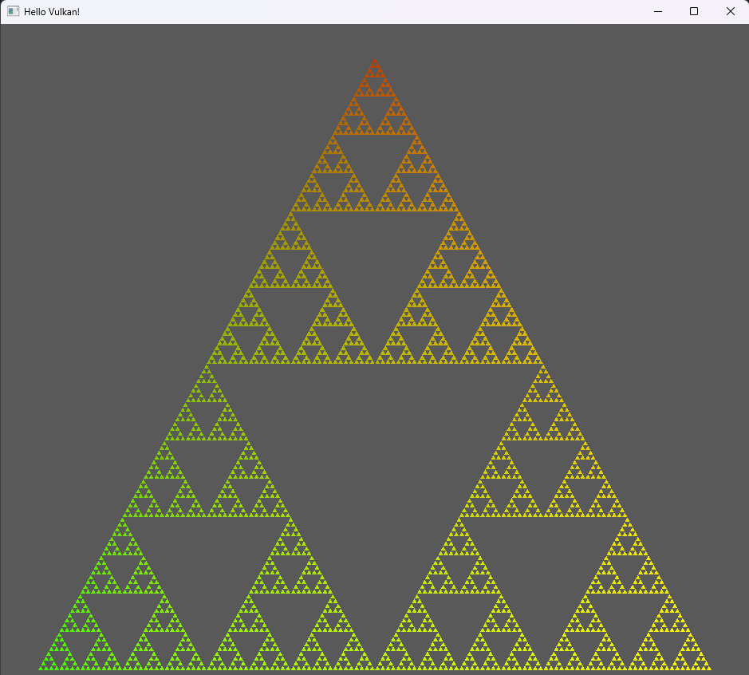

# Vulkan-Engine-cpp
This program uses Vulkan to render inside of a GLFW window and requires your computer to be compatible with Vulkan. \
This is a game engine prototype I'm creating by following [this tutorial](https://www.youtube.com/playlist?list=PL8327DO66nu9qYVKLDmdLW_84-yE4auCR). \
All libraries and headers are included so it should be as plug and play as possible. Makefile can cross-compile to a Windows executable using MinGW. \
Uses C++20 by default.

## Download/Execution
Just pull, `cd` into the repo, and call `make`. Default directive is to build for Windows, run `make linux` to build 
for linux.

## Dependencies
Everything needed is included. Your computer must support the Vulkan API. \
To compile for Windows, as stated above, a MinGW compiler is required. *The included GLFW library is built for MinGW not MSVC*. \
The MinGW compiler that I'm using is from the Ubuntu 22.04 package manager (jammy) on WSL.
If you're using Msys2 or w64devkit you will probably need to modify the make file directly to change which binary is being executed.

### Showcase:

